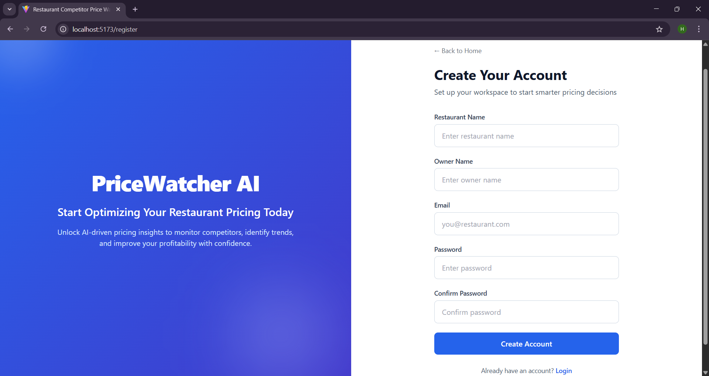

# 🍽️ Restaurant Competitor Price Watcher

A full-stack web application that enables restaurants to monitor competitor menu prices, analyze pricing trends, and make data-driven pricing decisions to maintain competitive advantage.

## 📖 Overview

Restaurant Competitor Price Watcher is designed to help restaurant owners and managers track nearby competitor pricing strategies. The platform provides comparative analytics, trend visualization, and actionable insights to support strategic pricing optimization.

The system follows a modular full-stack architecture with a React frontend, Flask backend, and MySQL database.

## 🚀 Features

- Competitor menu price comparison
- Price trend visualization
- Analytics dashboard
- Smart pricing insights
- Role-based authentication (Admin/Staff)
- Structured backend API architecture
- Modular and scalable frontend design

## 🏗️ System Architecture

- **Frontend:** React + Vite + Tailwind CSS
- **Backend:** Python (Flask REST APIs)
- **Database:** MySQL
- **Data Layer:** Competitor scraping module

The application follows separation of concerns and clean architecture principles to ensure scalability and maintainability.

## 🛠️ Technology Stack

### Frontend

- React
- Vite
- Tailwind CSS
- JavaScript (ES6+)

### Backend

- Python
- Flask

### Database

- MySQL

### Version Control

- Git
- GitHub

## 📂 Project Structure

```text
PriceWatcher_AI/
│
├── backend/
│   ├── app.py
│   ├── config.py
│   ├── scraper/
│   └── requirements.txt
│
├── frontend/
│   ├── src/
│   ├── public/
│   ├── package.json
│   └── vite.config.ts
│
└── README.md
```

## ⚙️ Installation & Setup

### 1️⃣ Clone the Repository

```bash
git clone https://github.com/navarojreddy48/PriceWatcher_AI.git
cd PriceWatcher_AI
```

### 2️⃣ Backend Setup

```bash
cd backend
pip install -r requirements.txt
python app.py
```

### 3️⃣ Frontend Setup

```bash
cd frontend
npm install
npm run dev
```

## 📊 Usage

1. Start the backend server.
2. Launch the frontend development server.
3. Access the dashboard in your browser.
4. Monitor competitor prices and analyze trends.

## 📸 Application Screenshots

### Landing Page


### Login Page


### Sign Up Page


### Admin Dashboard


### Staff Dashboard


### Admin Competitor View


### Admin Staff Management


### Admin Analytics


### Staff Analytics


## 🔐 Security & Best Practices

- Modular code organization
- Environment-based configuration
- Role-based authentication
- Clean separation between frontend and backend
- Scalable project structure

## 📈 Future Enhancements

- Real-time competitor API integration
- Machine learning-based price prediction
- Cloud deployment support
- Automated alerts for price changes
- Advanced business intelligence dashboard